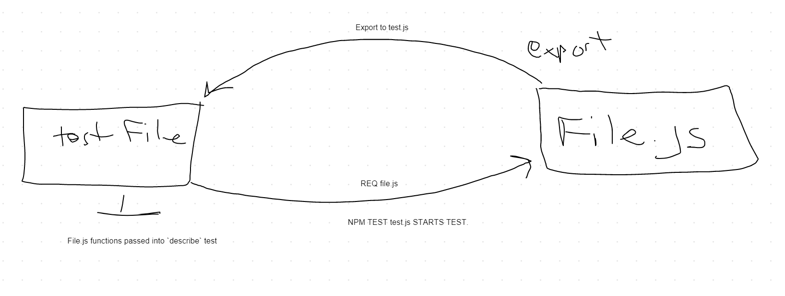

# Challenge Summary

Create a test function that evaluates a function from array-binary-search.js

## Challenge Description

#### Below is test documation 
Write a function called BinarySearch which takes in 2 parameters: a sorted array and the search key. Without utilizing any of the built-in methods available to your language, return the index of the array’s element that is equal to the search key, or -1 if the element does not exist.

## Approach & Efficiency

I always write the test first. Then, I test the "test" by hard coding the answer into the exported .js file. Once the test passed, then I went to work writing the function to run through the test. 

## Solution
