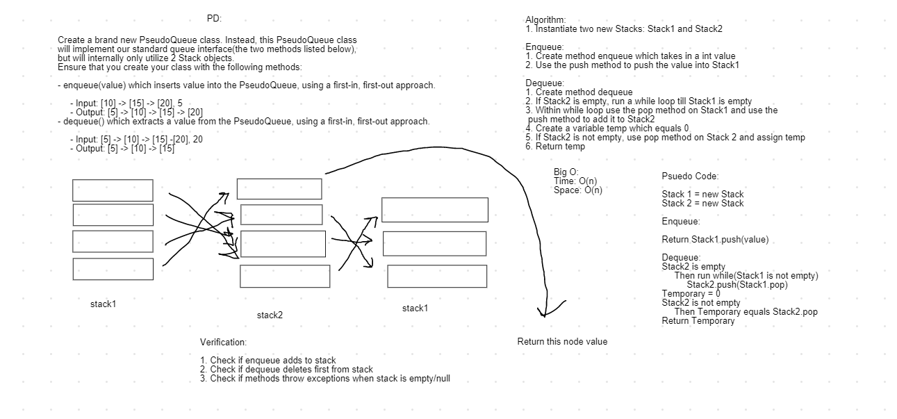
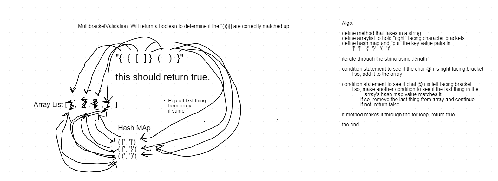
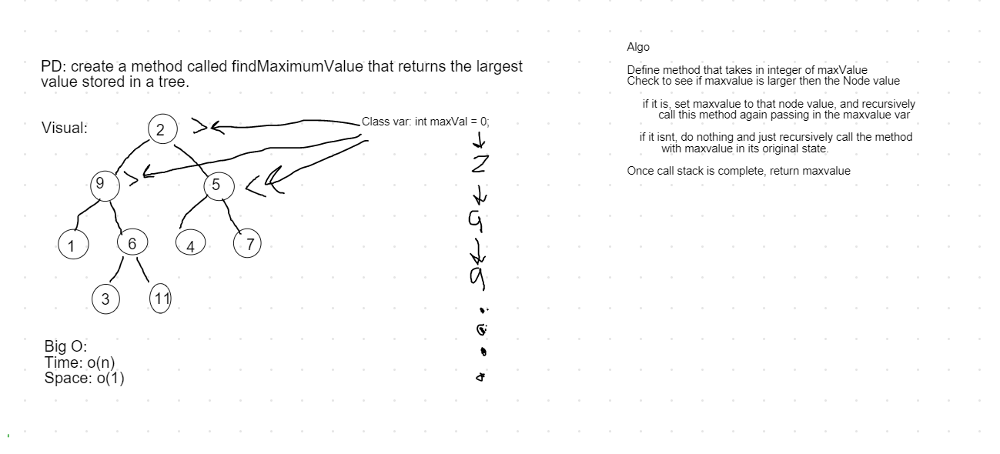
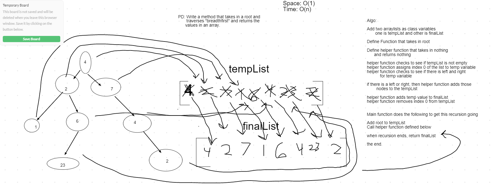
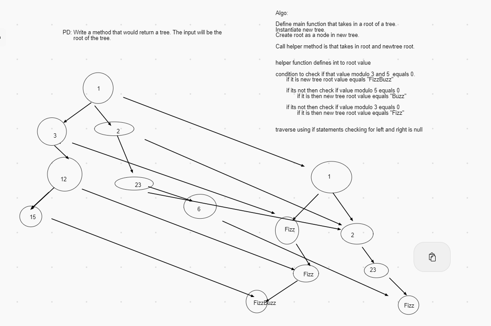

#### kthFromEnd:

Method takes in an integer as the value from the tail of the Linked List.
Time: O(n)
Space O(n)

#### zip:

Method takes in 2 linked lists and returns the "merged" single list of the two of them.

Time: 0(n)
Space: 0(2n) - Since we are not creating a third linked list to return and simply mutating one list to get the final result, the space is only 2 n.

#### PseudoQueue

PsuedoQueue instantiates two new stacks to be utilized to "act" as a Queue.

Methods: 

    enqueue - utilizes the push method to add a node to the stack.
    dequeue - utilizes both stacks and used the push and pop methods to deconstruct 
              the initial passed in stack, and builds the second stack(aka reversing the stack)
              Then it pops the top off the second stack 
              Then it builds the first stack back up with the values from the second.
Testing:

    Tests make sure the enqueue works both by checking the entire stack and the return values

#### MultiBracketValidation

Methods:

    multiBracketValidation - returns a boolean. 
        Inputs are a simple string. The method will ignore all characters except for "(){}[]"

        
Testing: 

    Tested for true values and false values. i.e. "[[]]" would return true, and "[[]]]" would return false.
    
 
 
 
 #### FindMaxValue
 
 Methods: 
 
    findMaxValue - returns the largest value in the tree. 
        The only input needed is the root of the tree. Should be known that I created a class Variable to make it so the recursion could call upon the variable and give the node value something to compare against.
 
 Testing:
 
    Only thing to test is to make sure that different large values were passed into the maxValue variable and returned. Also tested for "NotEquals" to show that it would also work in the opposite direction given the wrong MaxValue.
    
 This method is o(1) space since it doesn't create anything, and o(n) time because we are recursively adding to an unknown size call stack.
 
 
 
 
 #### BreadthFirst
 
 Methods:
 
    breadthFirst - returns finalArr(class variable). Only job is to add the initial root of the tree to the temporary arraylist (tempArr). Then it kicks off the recursive function by calling the helper function below.
    bFHelper - this helper function assists the the main function with traversal. It sets a temp variable to the index 0 of the tempArr and checks to see its left and right. Then adds those nodes to the temp arr if they exist. After that it adds the temp value to the final arr and removes index 0 of the temp arr.
    
 Testing:
 
    I created two different trees and tested to see if I got the same Array in breadthfirst style. I used Arrays.asList() to enter the expected values.
    
 
 
 
 #### FizzBuzz
 
 Methods:
 
    fizzBuzz - returns another tree. This method only instantiates another tree using the Generic Node. Then calls the helper function.
    fizzHelper - this checks the value in the initial tree to check to see if its divisible by 3 and 5 and determines the string that should be added to the new tree. The new tree also adds a new node to the respective left or right if it exists before recursively calling this function.
    
 Testing: 
 
    I created a tree with some nodes divisible by 3, 5, or both. Then, called for my orderhelper method to present the array with all the values.
    
 