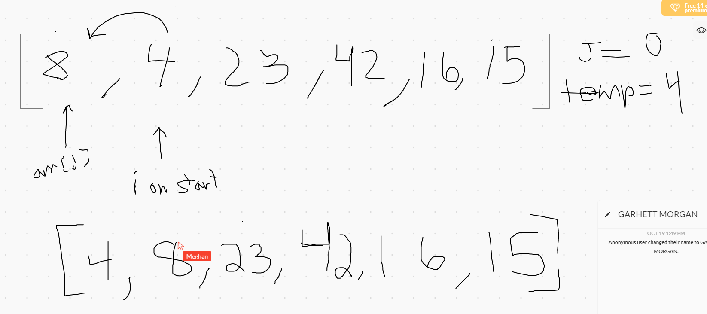
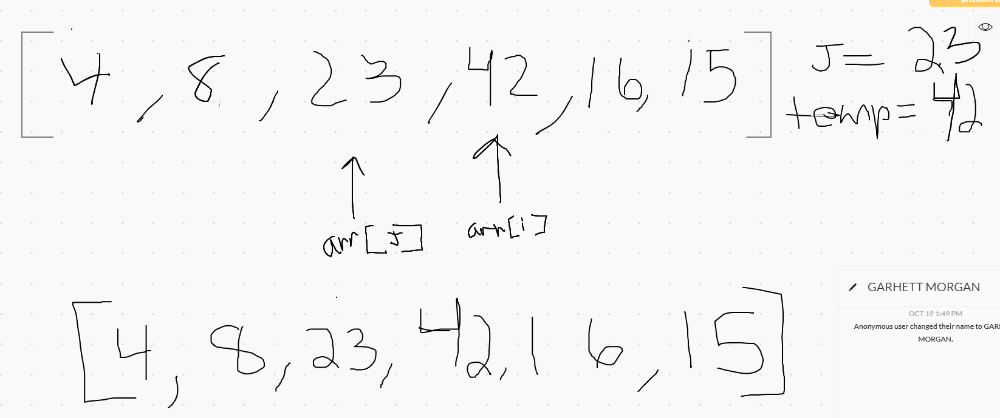
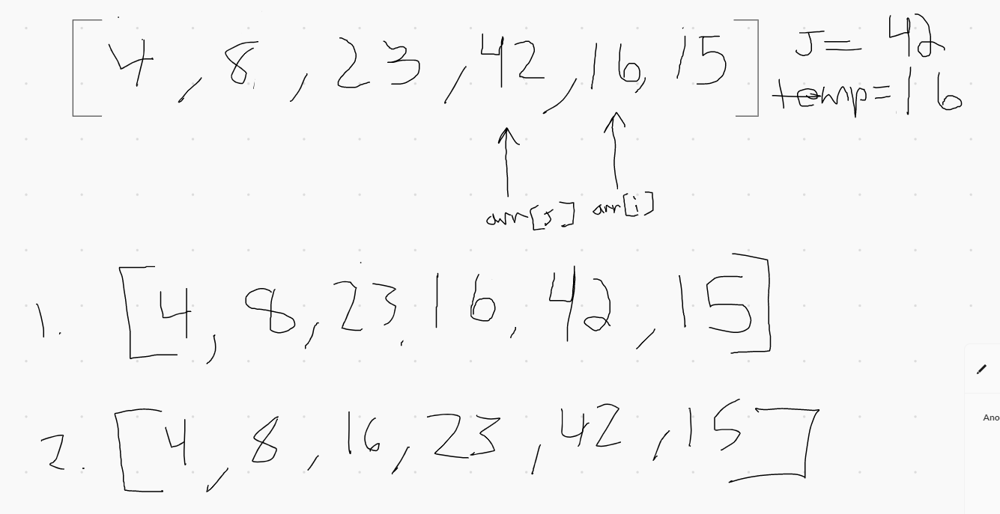
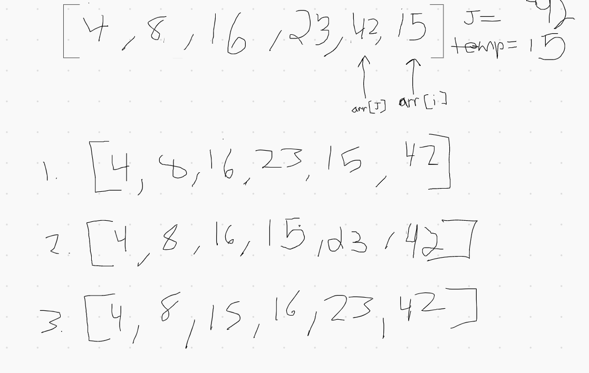

# Insertion Sort
### Pseudocode
 ```
InsertionSort(int[] arr)
    FOR i = 1 to arr.length
      int j <-- i - 1
      int temp <-- arr[i]
      WHILE j >= 0 AND temp < arr[j]
        arr[j + 1] <-- arr[j]
        j <-- j - 1
      arr[j + 1] <-- temp
```
 ### Trace
 [8, 4, 23, 42, 16, 15]
 ###### Pass 1
 
 
 First iteration starts at "4" and sets `arr[j]` to the index behind "i". Then checks to see if the
  values are in order (`[8, 4, ...]`). Since they are not, method will swap indices with the
   values (`[4, 8, ...]`) and since we are using a while loop, it will recheck by updating "j" to
    the index in front of it to make sure there isn't another value that the current replaced value
     needs to jump ahead of. Since "4" is at the very front of the array, we iterate through the
      next pass of the for loop.
      
Array at end of first pass: `[4, 8, 23, 42, 16, 15]` 

    
###### Pass 2
  
Second iteration starts at "23" and sets `arr[j]` to "8" `[..., 8, 23, ...]`. Since these are in the
 right order, the while loop will not be accesed and we will iterate through to the next pass.
 
Array at end of second pass: `[4, 8, 23, 42, 16, 15]` 


###### Pass 3

Third iteration starts at "42" and sets `arr[j]` to "23" `[..., 23, 42, ...]`. Since these are in the
 right order
, the
 while loop will not be accessed and iterate through to the next pass.
 
Array at end of third pass: `[4, 8, 23, 42, 16, 15]`

###### Pass 4

Fourth iteration starts at "16" and sets `arr[j]` to "42" `[..., 42, 16, ...]`. These are out of
 order so the while loop is accessed and the first swap occurs (`[..., 16, 42, ...]`). The while
  loop reassigns "j" to the index in front of it, and checks again until the original `arr[i]` is
   in the right spot in the order.
   
Array at end of fourth pass: `[4, 8, 16, 23, 42, 15]`

###### Pass 5

Fifth and final pass starts at "15" and sets `arr[j]` to "42" `[..., 42, 15, ...]`. These are
 also out of order so the while loop performs the same logic as before in pass 4 and pass 1. 
 
Array at end of fifth pass: `[4, 8, 15, 16, 23, 42]`


### Efficiency
- Time: O(n^2)
    - The basic operation of this algorithm is comparison. This will happen n * (n-1) number of
     times. Anytime you have two loops nested like this, you can assume that the time efficiency
      will be n^2.  

- Space: O(1)
    - No additional space is being created. This array is being sorted in place…keeping the space
     at constant O(1).